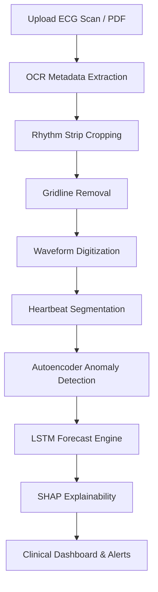

# SilentPulse  
### AI-Powered ECG Digitization & Cardiovascular Prognostics Platform

> Transforming analog ECG reports into explainable AI-driven cardiac intelligence.

---

# Overview

SilentPulse is an AI-powered clinical diagnostics platform designed to bridge traditional paper-based ECG reports and modern deep-learning cardiovascular analysis systems.

The platform automatically processes scanned ECG reports (PDFs, images, photographs), digitizes waveform signals, detects abnormalities, forecasts deterioration trends, and provides explainable diagnostic insights for clinicians.

Instead of manually tracing ECG signals or entering metrics by hand, SilentPulse performs the entire pipeline automatically within seconds.

---

# Problem Statement

Many hospitals and clinics still rely on paper ECG reports, making large-scale digital analysis difficult.

Current challenges include:

- Manual ECG interpretation is time-consuming
- Analog reports are difficult to archive and analyze
- Rural and low-resource hospitals lack AI diagnostic infrastructure
- Existing ECG AI systems often require already-digitized signals
- Most AI models operate as black boxes without explainability

SilentPulse addresses these challenges by converting raw ECG scans directly into explainable clinical intelligence.

---

# Key Features

- OCR-based patient metadata extraction
- Automatic ECG rhythm strip isolation
- Gridline removal using OpenCV
- ECG waveform digitization into numerical signals
- Autoencoder-based anomaly detection
- LSTM-based cardiac trend forecasting
- SHAP-powered explainable AI diagnostics
- Interactive clinical dashboard
- Automated medical warning system
- Responsive futuristic healthcare UI

---

# System Architecture

---

# Workflow Pipeline

## 1. OCR Metadata Extraction

The uploaded ECG scan is processed using EasyOCR.

### Extracted Information
- Patient details
- Date of birth
- Study date
- Heart rate
- Doctor observations
- Clinical notes

### Intelligent Parsing
SilentPulse automatically:
- Calculates patient age
- Detects arrhythmia-related keywords
- Parses medical indications
- Identifies risk-related terms

---

## 2. ECG Signal Digitization

Paper ECG reports contain noisy colored grids that interfere with waveform extraction.

### Processing Steps

#### Rhythm Strip Cropping
The continuous ECG strip is automatically isolated from the report layout.

#### Gridline Removal
Using OpenCV + HSV masking:
- Pink/red ECG grids are removed
- Waveform ink is preserved

#### Waveform Tracing
The signal is:
- Traced pixel-by-pixel
- Interpolated to repair gaps
- Smoothed into a continuous mathematical waveform

### Output
A clean digital ECG signal ready for AI analysis.

---

## 3. Autoencoder-Based Anomaly Detection

SilentPulse uses a PyTorch Autoencoder trained only on healthy ECG patterns.

### Process
1. ECG waveform is segmented into heartbeats
2. Each heartbeat is reconstructed by the model
3. Reconstruction loss is calculated

### Principle

Normal heartbeat:
- Low reconstruction loss

Abnormal heartbeat:
- High reconstruction loss

This enables detection of:
- Arrhythmias
- Premature Ventricular Contractions (PVCs)
- Conduction abnormalities
- Irregular cardiac activity

---

## 4. LSTM Forecasting Engine

A PyTorch LSTM network acts as an early-warning cardiovascular forecasting system.

### Input
Sequential anomaly scores across heartbeats.

### Output
Forecasts:
- Cardiac stability
- Deterioration progression
- Escalating abnormality trends

### Prediction Horizon
Projects risk trends for the next 5 heartbeats.

---

## 5. SHAP Explainability Engine

SilentPulse incorporates Explainable AI (XAI) using SHAP.

Instead of producing black-box predictions, the platform explains:
- Which ECG segment caused abnormalities
- Why anomaly scores increased

### Anatomical Region Mapping
- P-wave
- PR interval
- QRS complex
- ST segment
- T-wave

### Clinical Benefits
Doctors can:
- Interpret AI decisions
- Validate abnormalities quickly
- Locate conduction and repolarization issues

---

# Clinical Dashboard

The frontend delivers a futuristic medical monitoring interface.

## Features

### Interactive ECG Visualization
- Clickable heartbeat peaks
- Dynamic waveform exploration
- Zoom-enabled signal review

### Automated Clinical Alerts

Examples:
- `CRITICAL: Flatline detected`
- `Moderate PVC activity`
- `Potential ventricular irregularity detected`

### Recommendation Engine
Suggested actions:
- Emergency review
- Cardiology consultation
- Continuous monitoring

### Responsive UI
Optimized for:
- Tablets
- Laptops
- Wide-screen hospital displays

---

# Innovation Highlights

SilentPulse uniquely combines:

- Computer Vision
- Signal Processing
- Deep Learning
- Explainable AI
- Forecasting Systems
- Clinical Decision Support

into a unified cardiovascular intelligence pipeline.

---

# Technology Stack

## AI & Deep Learning
- PyTorch
- NumPy
- SciPy

## Computer Vision
- OpenCV
- EasyOCR

## Explainable AI
- SHAP

## Frontend
- React.js
- TailwindCSS
- Chart.js / Recharts

## Backend
- Python
- Flask / FastAPI

---

# Potential Impact

SilentPulse can help:

- Rural healthcare centers digitize ECG records
- Hospitals automate cardiac screening
- Doctors detect abnormalities earlier
- Telemedicine platforms analyze ECG scans remotely
- Medical institutions modernize analog archives

---

# Future Scope

- Real-time wearable ECG integration
- Multi-lead ECG reconstruction
- Cloud-based deployment
- Federated learning for privacy-preserving AI
- Transformer-based cardiac sequence modeling
- ICU continuous monitoring systems

---

# Research Significance

SilentPulse demonstrates how AI can bridge the gap between traditional medical infrastructure and modern intelligent healthcare systems.

The project focuses on:
- Accessibility
- Explainability
- Scalability
- Clinical usability
- Early risk prediction

---

# Disclaimer

SilentPulse is a research and competition prototype and is not currently approved for clinical diagnosis or emergency medical deployment.

All medical decisions should be validated by licensed healthcare professionals.

---

# Developed By

**Harini**  
AI + Healthcare Innovation Project

---
